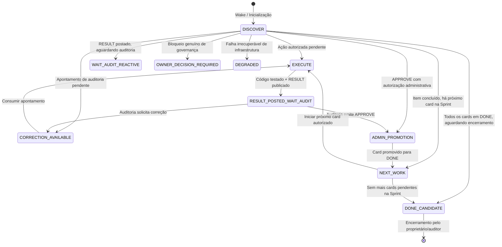

# Antigravity Sprint Continuity Skill (Soberana Global)

## 0. Canonical Operational Authority & Precedência Soberana
Esta Skill define a **política soberana GLOBAL de continuidade operacional** do Antigravity para toda e qualquer Sprint em andamento.

### Ordem Canônica de Autoridade Operacional:
1. **Segurança e Decisão Humana Explícita**: Integridade do host, proteção de segredos/permissões e diretivas com `OWNER_DECISION_REQUIRED: true`.
2. **DONE_GATE e Contrato Factual**: Critérios de aceite imutáveis da Issue/Sprint no GitHub.
3. **Skill Soberana Global `antigravity-sprint-continuity`**: Garantia ininterrupta de continuidade operacional entre etapas.
4. **Down Plant e Skills Especializadas**: Políticas subordinadas para decomposição técnica, limites de arquivos, gates de qualidade e evidências.
5. **Convenções e Prompts Locais Legados**: Diretrizes operacionais auxiliares.

### Precedência Explícita sobre Down Plant e Subordinadas:
A Skill **Down Plant** fornece disciplina técnica de execução, localização e segurança, mas **não pode encerrar a continuidade operacional da Sprint** por regras locais de parada. Toda regra de parada local conflitante é automaticamente reclassificada como `SUPERSEDED_FOR_CONTINUITY`:

| Regra Local Subordinada | Efeito Original | Reinterpretação Soberana (`SUPERSEDED_FOR_CONTINUITY`) |
| :--- | :--- | :--- |
| **Down Plant (Item 13)**: *"Parar após a entrega"* | Encerra processo/agente | **`WAIT_REACTIVE_AND_RESUME_ON_AUDIT`** (arma espera reativa e retoma ao receber auditoria) |
| **Aguardar humano sem bloqueio crítico** | Pausa exigindo intervenção | **`CONTINUE_WHEN_VALID_ACTION_EXISTS`** (consome próximo trabalho válido da mesma Sprint) |
| **STOP após RESULT** | Para o runtime | **`WAIT_REACTIVE_AND_RESUME_ON_AUDIT`** |
| **STOP após REVIEW** | Para o runtime | **`WAIT_REACTIVE_AND_RESUME_ON_VALID_EVENT`** |
| **Encerrar turno após entrega** | Mata sessão | **`RECONCILE_AND_SEEK_NEXT_VALID_WORK`** |
| **Ausência de sucessor local** | Declara NO_WORK imediato | **`RECONCILE_GITHUB_PROJECT_BRIDGE_BEFORE_STOP`** |

---

## 1. Purpose (Finalidade)
Garantir que o fluxo operacional de uma Sprint em andamento não seja interrompido arbitrariamente entre a emissão de uma chamada (`CALL`), execução técnica, publicação de resultado (`RESULT`), auditoria (`AUDIT`), solicitação de correção (`CORRECTION`), promoção administrativa de cards e encaminhamento do próximo trabalho válido.

O Antigravity atua como executor contínuo e disciplinado:
- Executa imediatamente quando houver ação válida autorizada;
- Entra em espera reativa passiva (`WAIT_AUDIT_REACTIVE`) quando a próxima ação depender de auditoria externa (ChatGPT) ou decisão humana;
- Desperta automaticamente e sem latência ao receber eventos via Bridge V2 ou Telegram;
- Jamais se autoaprova nem fecha tarefas unilateralmente.

---

## 2. Triggers (Gatilhos de Ativação)
A Skill é ativada pelo runtime do Antigravity nas seguintes circunstâncias:
1. **Despertar via Bridge V2 (`/wait_wake`)**: Recebimento de envelope `[BRIDGE_TO_ANTIGRAVITY_V1]` contendo tipo `CALL`, `MESSAGE`, `AUDIT` ou `OWNER_DIRECTIVE`.
2. **Despertar via Telegram (`getUpdates`)**: Recebimento de mensagem de texto de usuário autorizado na allowlist.
3. **Inicialização / Retomada de Sessão**: Verificação do journal de continuidade (`sprint_continuity_journal.json`), auditoria de precedência e reconciliação do `expected_next_event`.
4. **Finalização de Execução Técnica**: Transição obrigatória para publicação de `RESULT` e entrada em espera reativa de auditoria.

---

## 3. Sources of Truth & Roles (Fontes de Verdade e Papéis)
- **GitHub Issues e Comentários**: Contrato canônico e imutável de escopo, critérios de aceite, chamadas, resultados, auditorias e correções.
- **GitHub Project (Kanban)**: Representação visual consolidada do status da Sprint. Reconciliado com as Issues antes de qualquer transição para `DONE` ou `NO_WORK`.
- **ChatGPT**: Planejador, auditor e guardião de governança da Sprint. Responsável exclusivo por emitir pareceres de auditoria (`APPROVE`, `CORRECTION_REQUIRED`) e autorizar encerramentos.
- **Antigravity (Executor Down Plant)**: Agente de execução técnica local. Observa, implementa código, roda testes reais, prova comportamento LIVE e publica `RESULT`. **Proibido de se autoaprovar**.
- **Bridge V2 (Porta 8765)**: Barramento de transporte de eventos locais entre ChatGPT (via extensão Chrome) e Antigravity.
- **Telegram & ChatGPT**: Canais simétricos e equivalentes de interação com o proprietário humano.
- **Vigia**: Sentinela de observabilidade externa e fallback estrito; nunca segundo executor concorrente.

---

## 4. State Machine (Máquina de Estados Operacional)
Em qualquer momento da Sprint, o sistema deve estar classificado em exatamente um dos seguintes 9 estados:



---

## 5. Execution Loop & Anti-Parada
Para impedir paradas indesejadas na esteira de desenvolvimento:
1. **Consumo Direto**: Se o estado for `EXECUTE`, `CORRECTION_AVAILABLE`, `ADMIN_PROMOTION` ou `NEXT_WORK`, o agente age de imediato. Não aguarda mensagens como "continue", "prossiga" ou "V".
2. **Espera Reativa Estrita (`WAIT_AUDIT_REACTIVE`)**:
   - Ao publicar `RESULT`, o agente armazena no journal local:
     ```json
     {
       "sprint_id": "...",
       "issue_number": 52,
       "call_id": "...",
       "phase": "RESULT_POSTED_WAIT_AUDIT",
       "expected_next_event": "AUDIT",
       "timestamp": "..."
     }
     ```
   - O listener unificado reativo (`UnifiedReactiveWakeListener`) permanece armado na Bridge e no Telegram.
   - O processo entra em pausa sem consumir tokens ou CPU em laços de polling agressivo.
   - Assim que o auditor (ChatGPT) ou o proprietário (Telegram/ChatGPT) enviar a resposta, o listener acorda o Antigravity com o payload exato.

---

## 6. Dedupe & Single-Flight
1. **Chave Canônica de Despacho**:
   Toda ação mutável deve gerar uma chave determinística:
   `KEY = {SPRINT_ID}:{ISSUE_NUMBER}:{CALL_ID}:{ACTION_KIND}`
2. **Histórico Local**:
   - Chaves processadas são persistidas em `sprint_continuity_journal.json`.
   - Se um evento chegar com uma chave já finalizada com sucesso, o sistema registra `NO_OP_DUPLICATE_DROP` e descarta a repetição.
3. **Single-Flight Estrito**:
   - Apenas uma mutação de código, teste ou chamada de API do GitHub é executada por vez.
   - Eventos concorrentes de canais distintos são serializados na fila sem perda de contexto.

---

## 7. Recovery & Rehydration (Recuperação de Falhas e Reinício)
Ao reiniciar o processo, recarregar a janela de contexto ou restabelecer a conexão:
1. O motor lê `sprint_continuity_journal.json`.
2. Executa auditoria de conflito de regras de parada, reconfirmando as regras `SUPERSEDED_FOR_CONTINUITY`.
3. Se houver `inflight_action`, realiza verificação factual contra o GitHub/Git para confirmar se a ação foi concluída antes da queda.
4. Reidrata o `expected_next_event` e retoma exatamente do ponto de suspensão sem duplicar commits, comentários ou mutações.
5. Se o status de envio para a Bridge for incerto, assume `SEND_UNCERTAIN` e faz consulta de reconciliação antes de reenviar.

---

## 8. Human Intervention (Intervenção Humana Simétrica)
- O proprietário pode interagir a qualquer momento via **Telegram** ou **ChatGPT**.
- A linguagem natural é interpretada contextualmente pelo roteador sem requerer sintaxe especial (nada de prefixos, slash-commands ou códigos rígidos).
- Se a mensagem humana contiver uma diretiva técnica válida, ela assume prioridade operacional dentro do escopo da Sprint.
- Mensagens conversacionais são respondidas factualmente nos seus respectivos canais de origem, sem emitir templates robóticos de "secretária eletrônica".

---

## 9. Stop Conditions & Proibições Absolutas
### Stop Conditions (Critérios de Parada Legítimos):
1. Publicação de `RESULT` em Issue aberta em `REVIEW`, aguardando auditoria do ChatGPT.
2. Chegada em `DONE_CANDIDATE` (100% da Sprint concluída), aguardando fechamento administrativo pelo auditor/proprietário.
3. Ocorrência de `OWNER_DECISION_REQUIRED: true` genuíno.

### Comportamentos Terminantemente Proibidos:
- ❌ **Autoaprovação**: Declarar o próprio trabalho como "aprovado", "homologado" ou "sucesso".
- ❌ **Fechamento Prematuro**: Fechar issues ou pull requests antes da homologação formal do auditor.
- ❌ **Secretária Eletrônica**: Responder mensagens com templates robóticos pré-programados (*"Compreendi perfeitamente sua mensagem..."*).
- ❌ **Multiplicidade de Processos**: Criar segundos daemons, pollers em loop ou instâncias paralelas da Bridge/Vigia.
- ❌ **Vazamento de Segredos**: Expor `chat_id` numérico, tokens de bot, PATs do GitHub ou credenciais em logs ou comentários públicos.
- ❌ **Ampliação de Escopo**: Iniciar fatias de trabalho ou funcionalidades não previstas na Issue em execução.

---

## 10. Evidence Contract (Contrato de Evidência Auditável)
Todo ciclo executado sob esta Skill deve produzir evidências auditáveis estruturadas:
- `skill_path`: Caminho versionado do arquivo `SKILL.md`.
- `runtime_mechanism`: Mecanismo factual de carregamento verificado no runtime.
- `scope`: `GLOBAL`.
- `precedence`: `SOVEREIGN_OPERATIONAL_CONTINUITY`.
- `superseded_rules`: Lista de regras de parada locais superadas para garantir continuidade ininterrupta.
- `sprint_id`, `issue_number`, `call_id`: Identificadores unívocos da operação.
- `state_transitions`: Sequência de estados percorridos (`antes -> depois`).
- `expected_next_event`: Evento aguardado pelo runtime.
- `github_comment_ids`: IDs dos comentários de RESULT e AUDIT no GitHub.
- `channels_observed`: Canais validados (Telegram message_id, Bridge call_id).
- `git_commit`: Hash do commit gerado na execução.
